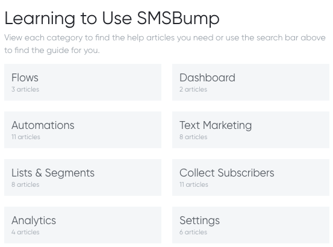
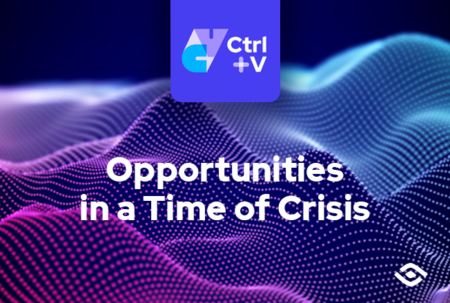

## Portfolio

---

### User Assistance

<a href="https://www.youtube.com/watch?v=LLiI2L_pwHI&feature=emb_title" target="_blank">Video Tutorial on SMS Marketing</a> 

_This project involved creating a set of tutorial videos, that walk users through step-by-step on how to use a Text Marketing app on Shopify. The process involved testing software features to eliminate bugs, writing a script, screen and voice recording, editing using Camtasia, and optimizing the SEO for the YouTube channel before publishing and sharing on social media._
<iframe width="560" height="315" src="https://www.youtube.com/embed/LLiI2L_pwHI" frameborder="0" allow="accelerometer; autoplay; clipboard-write; encrypted-media; gyroscope; picture-in-picture" allowfullscreen></iframe>

---
  
<a href="https://smsbump.com/Text-marketing-campaigns-that-sell.pdf" target="_blank">eBook on Text Campaigns</a> 

_This eBook's target audience was eCommerce businesses who were new to SMS marketing and needed a brief introduction to the method of advertising. Technical tips and tricks were written, and visual aids in the form of digarams were created in order to simplify an otherwise complex process. The eBook was published as gated content on the SMSBump website with the goal to gain subscribers._
<iframe frameborder="0" height="950px" title="eBook on Text Campaigns" longdesc="Text Marketing Campaigns That Sell" name="eBook" scrolling="no" src="inaiontcheva.github.io/docs/ebooksmsmarketing.pdf" width="100%"></iframe>

---
  
<a href="https://smsbump.com/knowledge-base" target="_blank">Knowledge Base for Shopify App</a> 

_A series of knowledge base articles were written concisely, covering a wide range of the SMSBump app features.  Images were designed using Sketch and then added to illustrate each step the user must take to complete an action successfuly._

---
  
<a href="https://www.youtube.com/watch?v=z-eUOMbb7hE&feature=emb_title" target="_blank">Website Navigation Webinar</a> 

_This project's aim was to familiarize graduate university applicants with the helpful resources and tools available on the Prepadviser preparation platform through a pre-recorded webinar. Planning involved sketching UX flows, review of sections in order of hierarchy, script writing, recording and editing before launching a webinar registration form, and playing the video on GoToWebinar. This allowed to actively engage with participants on the day of the event and promtly answer their questions, directing them to the appropriate link and following up with a personalized email._

<iframe width="560" height="315" src="https://www.youtube.com/embed/z-eUOMbb7hE" frameborder="0" allow="accelerometer; autoplay; clipboard-write; encrypted-media; gyroscope; picture-in-picture" allowfullscreen></iframe>

---
  

### Blogging

[Ctrl+V Podcast](https://www.scalefocus.com/blog/podcast)

_I began by pitching a project proposal to the marketing team, focusing on the benefits of creating a versatile tool that will expand the reach of our company's content, as well as the ability to capture and build a strong relationship with clients. The podcast Ctrl+V was created to engage and strengthen our online presence and community. The episodes deliver valuable, up-to-date information on tech trends and highlight the specter of our solutions and services through guest expert interviews. A Blubrry plugin was installed on Wordpress, so the podcast could be self-hosted._

<iframe src="https://www.scalefocus.com/?powerpress_pinw=18648-podcast" frameborder="0" width="500" height="50" allow="accelerometer; clipboard-write; encrypted-media; gyroscope; picture-in-picture" allowfullscreen></iframe>

  
 
 [Technical Insights](https://www.scalefocus.com/insights/tap-into-the-potential-of-energy-data-analytics-using-streaming)
 
 _The Technical Insights section is a set of blog articles which analyze the challenges businesses are facing today, and introduce different ways technologies can help solve them. The blog post process starts by reviewing the campaign calendar and receiving a brief for a new content piece. Then, it moves to collaborating on topics with the sales team, and establishing the topic. Meetings are booked for SME interviews in which services and solutions are discussed and linked to the topic. What follows is the writing and editing of drafts, before a final one gets approved to be published in Wordpress and shared on social media._
 
 
 
 
---

### White Papers and Case Studies

<a href="inaiontcheva.github.io/docs/AccGuide.pdf" target="_blank">Application Takeover Guide</a>

_This guide was written as gated content and placed at the end of a related blog article, as a supplementary content piece aiming to attract potential leads through a contact form. Content was written and edited in relation to the structure presented by the design team._

<iframe frameborder="0" height="950px" title="AccGuide" longdesc="App Takeover Guide" name="whitepaper1" scrolling="no" src="inaiontcheva.github.io/docs/AccGuide.pdf" width="100%"></iframe>

<a href="inaiontcheva.github.io/docs/2020CybersecrutiyTrendsOnFocus.pdf" target="_blank">Cybersecurity Trends Brief</a>

_This was a short gated content piece that was prepared with the effort to inform businesses on the latest cybersecurity trends and extend our service offering as the next step towards protecting their most critical assets. Report research was conducted as well as meetings with SMEs to confirm relevancy of facts and figures._

<a href="inaiontcheva.github.io/docs/EnergyCaseStudy.pdf" target="_blank">Energy Supply Case Study</a>

_Throughout the entire case study creation process, several meetings are conducted with SMEs, delivery managers and project managers to ensure that the information written is thorough and correct. Sales team is contacted to provide insight on any NDA or other agreements. Designers contribute with visual material that is unique for each case study and communicates the brand effectively._

<a href="inaiontcheva.github.io/docs/ApigeeCaseStudy.pdf" target="_blank">Apigee Case Study</a>

